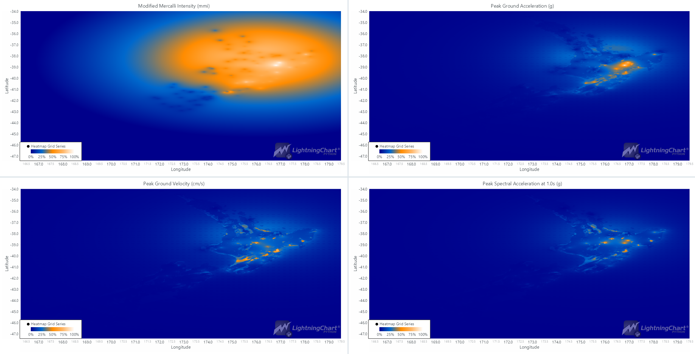

# Seismic Intensity Data Visualizing Python Application

 Visualizing ground shaking data utilizing LightningChart Python

## Introduction

Ground shaking is a fundamental characteristic of earthquakes and can cause significant damage to structures and landscapes, posing a risk to human life and property. Understanding the intensity and distribution of ground shaking is crucial for disaster preparedness, response, and recovery. This article delves into the development of a Python application that leverages LightningChart Python to visualize ground shaking data effectively, focusing on four vital seismic parameters: Modified Mercalli Intensity (MMI), Peak Ground Acceleration (PGA), Peak Ground Velocity (PGV), and Peak Spectral Acceleration (PSA).

## Understanding Seismic Parameters

To better understand the visualization of ground shaking data, it's good to understand the four main seismic parameters used in this project:

1. **Modified Mercalli Intensity (MMI)**:

   - MMI is a qualitative measure of the intensity of shaking experienced during an earthquake, as perceived by people and observed through damage to structures. It ranges from I (not felt) to XII (total destruction).
2. **Peak Ground Acceleration (PGA)**:

   - PGA measures the maximum acceleration of the ground during an earthquake, typically expressed in g (gravity). Assessing the earthquake's potential damage to buildings and infrastructure is crucial.
3. **Peak Ground Velocity (PGV)**:

   - PGV represents the maximum ground velocity reached during an earthquake, expressed in cm/s. It is an essential parameter for understanding the energy released by the earthquake and its impact on structures.
4. **Peak Spectral Acceleration (PSA)**:

   - PSA measures the maximum acceleration response of a building or structure at a specific natural period (e.g., 1.0 seconds) during an earthquake, expressed in g. It is used in designing buildings to withstand seismic forces.

## LightningChart Python

LightningChart Python is a powerful tool that excels in creating high-performance data visualizations. For this project, it offers the necessary functionality to render interactive charts that depict various aspects of seismic data. LightningChart Python's capabilities are particularly suited for applications requiring rapid updates and smooth user interactions, making it ideal for visualizing earthquake data.

## Setting Up Python Environment

To begin, you need to set up a Python environment with the necessary libraries. Here's a step-by-step guide:

**Install Python**: Download and install Python from the official [Python website](https://www.python.org/downloads/).

**Install Libraries**: Use pip to install the required libraries:

```bash
pip install numpy lightningchart geopandas rasterio scipy
```

### **Overview of Libraries**:

- **[NumPy](https://numpy.org/doc/stable/)**: For numerical operations.
- **[LightningChart Python](https://lightningchart.com/python-charts/docs/)**: For creating high-performance charts.
- **[GeoPandas](https://geopandas.org/)**: For handling geospatial data.
- **[Rasterio](https://rasterio.readthedocs.io/en/latest/)**: For reading and writing raster data.
- **[SciPy](https://docs.scipy.org/doc/scipy/reference/)**: For scientific computations and interpolations.

### Setting Up the Development Environment:

Ensure you have a suitable IDE like Visual Studio Code or PyCharm, and set up a virtual environment to manage dependencies.

## Loading and Processing Data

The dataset used in this project is sourced from the [Shaking Layers GeoNet](https://shakinglayers.geonet.org.nz/). This data includes various seismic parameters stored in TIFF files. The available data is event-based, generated for specific earthquake events rather than continuously updated in real-time.

1. **Loading Data Files**: Read the TIFF files using Rasterio.

   ```python
   import rasterio

   # Function to read a TIFF file and return the data and transformation matrix
   def read_tiff(file_path):
       with rasterio.open(file_path) as src:
           data = src.read(1)
           transform = src.transform
       return data, transform
   ```
2. **Basic Data Processing Techniques**: Extract coordinates and values from the raster data.

   ```python
   # Function to extract coordinates and values from the TIFF data
   def extract_coordinates_and_values(data, transform):
       rows, cols = data.shape
       x_coords = []
       y_coords = []
       values = []

       for row in range(rows):
           for col in range(cols):
               x, y = transform * (col, row)
               x_coords.append(x)
               y_coords.append(y)
               values.append(data[row, col])

       return x_coords, y_coords, values
   ```
3. **Handling and Preprocessing Data**: Create GeoDataFrames for each parameter.

   ```python
   import geopandas as gpd

   # Dictionary to store GeoDataFrames for each parameter
   gdfs = {}

   # Create GeoDataFrames for each parameter using extracted coordinates and values
   for key, (data, transform) in data_dict.items():
       x_coords, y_coords, values = extract_coordinates_and_values(data, transform)
       gdfs[key] = gpd.GeoDataFrame({'value': values},
                                    geometry=gpd.points_from_xy(x=x_coords, y=y_coords))
       gdfs[key].set_crs(epsg=4326, inplace=True)  # Assuming WGS84
   ```

* **EPSG (European Petroleum Survey Group)** : EPSG codes are identifiers for coordinate reference systems (CRS) used to specify how geographic data is projected and transformed. In this case, `epsg=4326` is used.
* **WGS84 (World Geodetic System 1984)** : WGS84 is a global CRS used by the GPS system. It specifies coordinates in degrees of latitude and longitude. Setting the CRS to WGS84 ensures that the geographic data is correctly aligned on a global scale.

## Creating Charts for the Dashboard

**Setting Up the Dashboard**: Initialize the dashboard and charts for different parameters.

```python
import lightningchart as lc

# Set the license for LightningChart Python
lc.set_license("LICENSE_KEY")

# Initialize a dashboard with 2x2 grid layout and white theme
dashboard = lc.Dashboard(columns=2, rows=2, theme=lc.Themes.White)
dashboard.open(live=True)

# Initialize charts for different earthquake parameters
chart_intensity = dashboard.ChartXY(column_index=0, row_index=0, title='Modified Mercalli Intensity (MMI)')
chart_pga = dashboard.ChartXY(column_index=1, row_index=0, title='Peak Ground Acceleration (g)')
chart_pgv = dashboard.ChartXY(column_index=0, row_index=1, title='Peak Ground Velocity (cm/s)')
chart_psa = dashboard.ChartXY(column_index=1, row_index=1, title='Peak Spectral Acceleration at 1.0s (g)')
```

**Customizing Visualizations**: Adjust the appearance of heatmaps by setting palette colors and other visual properties.

```python
from scipy.interpolate import griddata
import numpy as np

# Function to create heatmap using Heatmap Grid Series
def create_heatmap(chart, x_values, y_values, values, grid_size=500):
    grid_x, grid_y = np.mgrid[min(x_values):max(x_values):complex(grid_size), min(y_values):max(y_values):complex(grid_size)]
    grid_z = griddata((x_values, y_values), values, (grid_x, grid_y), method='nearest')
    data = grid_z.tolist()

    series = chart.add_heatmap_grid_series(columns=grid_size, rows=grid_size)
    series.set_start(x=min(x_values), y=min(y_values))
    series.set_step(x=(max(x_values) - min(x_values)) / grid_size, 
	            y=(max(y_values) - min(y_values)) / grid_size)

    series.set_intensity_interpolation(True)
    series.invalidate_intensity_values(data)
    series.hide_wireframe()
    series.set_palette_colors(
        steps=[
            {'value': 0, 'color': lc.Color(0, 0, 139)},       # Deep blue
            {'value': 0.25, 'color': lc.Color(0, 104, 204)},  # Bright blue
            {'value': 0.5, 'color': lc.Color(255, 140, 0)},   # Bright orange
            {'value': 0.75, 'color': lc.Color(255, 185, 110)},# Light orange
            {'value': 1.0, 'color': lc.Color(255, 255, 255)}, # White
        ],
        look_up_property='value',
        percentage_values=True
    )
```

* Grid interpolation is a method used to estimate values at unknown points based on known data points. In this project, we use SciPy's `griddata` function to interpolate the seismic data onto a regular grid. This involves creating a mesh grid (grid_x, grid_y) that spans the range of x and y coordinates from the data. The `griddata` function then uses these grids and the known values to estimate the values at each grid point. The method 'nearest' is used to assign the value of the nearest known data point to each grid point.
* The `set_palette_colors` method allows for customization of the heatmap's color scheme. In this example, we define a color palette with five steps, ranging from deep blue for the lowest values to white for the highest values. This customization enhances the visual differentiation of various intensity levels in the heatmap, making it easier to interpret the data.

**Creating the Heatmaps**: Extract values for plotting and create heatmaps for each parameter.

```python
# Extract values for plotting for intensity
x_values_intensity = [point.x for point in gdfs['intensity'].geometry]
y_values_intensity = [point.y for point in gdfs['intensity'].geometry]
values_intensity = gdfs['intensity']['value'].tolist()

# Create the intensity heatmap with specified palette
create_heatmap(chart_intensity, x_values_intensity, y_values_intensity, values_intensity, 'Modified Mercalli Intensity', 'mmi')

# Extract values for plotting for pga
x_values_pga = [point.x for point in gdfs['pga'].geometry]
y_values_pga = [point.y for point in gdfs['pga'].geometry]
values_pga = gdfs['pga']['value'].tolist()

# Create the pga heatmap
create_heatmap(chart_pga, x_values_pga, y_values_pga, values_pga, 'Peak Ground Acceleration', 'g')

# Extract values for plotting for pgv
x_values_pgv = [point.x for point in gdfs['pgv'].geometry]
y_values_pgv = [point.y for point in gdfs['pgv'].geometry]
values_pgv = gdfs['pgv']['value'].tolist()

# Create the pgv heatmap
create_heatmap(chart_pgv, x_values_pgv, y_values_pgv, values_pgv, 'Peak Ground Velocity', 'cm/s')

# Extract values for plotting for psa at 1.0s
x_values_psa = [point.x for point in gdfs['psa_1.0'].geometry]
y_values_psa = [point.y for point in gdfs['psa_1.0'].geometry]
values_psa = gdfs['psa_1.0']['value'].tolist()

# Create the psa heatmap
create_heatmap(chart_psa, x_values_psa, y_values_psa, values_psa, 'Peak Spectral Acceleration at 1.0s', 'g')
```

## **End Result**

The final result is a dashboard with heatmap visualizations of the four seismic parameters: MMI, PGA, PGV, and PSA. This interactive dashboard allows users to explore and analyze the intensity and distribution of ground shaking for specific earthquake events. The area in the visualizations depicted is New Zealand's North Island where the earthquake had been detected and measured.



## Conclusion

In this article, we explored the development of a ground shaking layers intensity visualization application using Python. We covered setting up the Python environment, loading and processing seismic data, and visualizing this data using LightningChart Python. The use of LightningChart Python offers significant benefits, including high-performance rendering and interactive visualizations, making it an excellent choice for seismic data visualization projects.

It is important to note that the data available is event-based and updated based on significant earthquakes as processed by GNS Science seismologists. While real-time streaming is not possible, the application can effectively load and visualize the latest available data for each earthquake event. By following this guide, you can develop a powerful tool to visualize ground shaking layers, aiding in better understanding and preparedness for earthquake impacts. For more details, refer to the [Shaking Layers GeoNet](https://shakinglayers.geonet.org.nz/) for datasets and further resources.

## Sources

* USGS
* GeoNet
